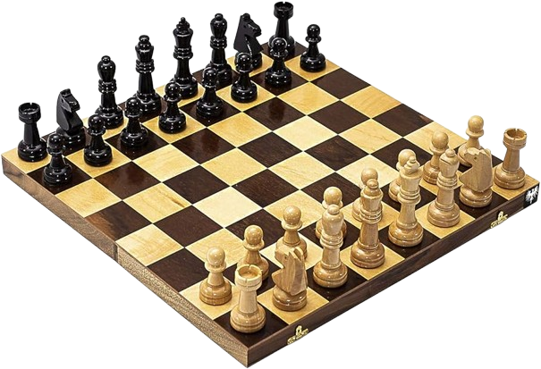

<h1 align=center> SISTEMA DE XADREZ </h1>

  

#
###  SOBRE

- Diretório contendo desenvolvimento do exercício proposto no curso de JAVA Orientado a Objeto na Udemy.

#
### CONTEUDO ABORDADO

- Classes e Objetos;
- Encapsulamento e Sobrecarga;
- Herança, Sobreescrita e Polimorfismo;
- Abstração e Interface;

#
### TECNOLOGIAS
&nbsp;
